# iThink web开发框架

*****
### **应用化**
>[danger]
> #### 像开发 安卓 / IOS 应用一样的开发web应用，iThink 提供完善的安装，卸载，打包机制，所有开发的应用都以一个应用包的形式存在，可以打包后免费或收费的分享他人使用

### **自动化**
>[danger]
> ###  一键生成web应用骨架代码和数据表的 CRUD,包括控制器口，模型，验证器等基类，实现高速开发
> #### 自动构造表格，表单元素，无需修改前端页面

### **抽象化**
>[danger]
> ####  iThink 分controller、logic、model、service、view 共5层，层层抽象，层层封装，最大限度的实现代码复用，无需编写一行重复代码

### **权限精细化**
>[danger]
> ####  基于 RBAC + Auth 的权限管理机制，精确到按钮的控制，每个按钮有 is_display 属性，配合 Auth 类可灵活控制页面上每个按钮的显示与否

## 体验demo <a target="_blank" href="http://demo.ithinkphp.org/admin">demo.ithinkphp.org/admin</a>
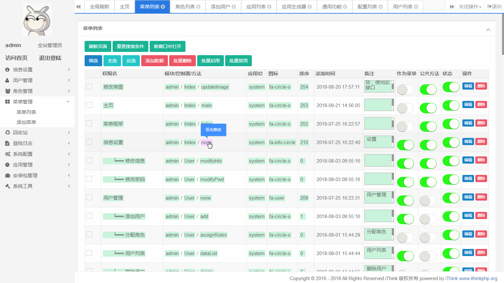

*****
* [ ] iThink是一个基于thinkphp5.0开发的模块化，应用化，自动构造化的WEB应用开发框架（Web Application Framework），集成高可用，高稳定的页面构造器，可以极其方便的构造后台页面包括表单，表格，上传等组件在内的各种元素！是笔者在参考了当前10多个主流的基于TP5的CMF/CMS的架构和思想后的沉淀出的产品！

* [ ] iThink实现应用与框架核心分离，可以将开发的应用打包，以免费或者收费的形式分享其他人使用。

* [ ] 服务器端CURD操作不需要修改前端html页面，前端页面所有元素都通过php构造完成，由笔者倾心打造的页面构造器，只为省去修改前端页面的烦恼。

* [ ] 页面所有元素都可定制，极大提高开发效率，10分钟即可完成一个表的curd功能，十分高效。

* [ ] 服务器端架构遵循十分先进的设计思想，灵活应用各种设计模式，分controller、logic、model、service、view 共5层，拥有一套自定义的依赖注入机制，将“抽象”的思想发挥的淋漓尽致，最大限度的实现代码复用，让你不需要多写一行重复代码，将全部精力投入编写应用逻辑！

		

		

		<table class="table">
			<tbody>
				<tr>
					<td>产品名称</td>
					<td>iThink</td>
				</tr>
				<tr>
					<td>官方网站</td>
					<td>
						<a target="_blank" href="http://www.ithinkphp.org">www.ithinkphp.org</a>
					</td>
				</tr>
				<tr>
					<td>后台演示</td>
					<td>
						<a target="_blank" href="http://demo.ithinkphp.org/admin">demo.ithinkphp.org/admin</a>（输入验证码即可登录）
					</td>
				</tr>
				<tr>
					<td>前台演示</td>
					<td>
						<a target="_blank" href="http://demo.ithinkphp.org">demo.ithinkphp.org</a>
					</td>
				</tr>
				<tr>
					<td>码云仓库</td>
					<td>
						<a target="_blank" href="https://gitee.com/wf5858585858/iThink">https://gitee.com/wf5858585858/iThink</a>
					</td>
				</tr>
				<tr>
					<td>交流社区</td>
					<td>
						<a target="_blank" href="http://forum.ithinkphp.org">forum.ithinkphp.org</a>
					</td>
				</tr>
				<tr>
					<td>开发手册（持续更新中）</td>
					<td>
						<a target="_blank" href="https://www.kancloud.cn/wf00568/main">https://www.kancloud.cn/wf00568/main</a>
					</td>
				</tr>
				<tr>
					<td>交流QQ群</td>
					<td>419395011</td>
				</tr>
				<tr>
					<td>联系邮箱</td>
					<td>wf585858@yeah.net</td>
				</tr>
			</tbody>
		</table>
	

#### :-: **特性**

#### 高效开发-表单与表格元素构造器
* [ ]  由笔者倾心打造的页面构造器类库，所有的常用的页面元素，可以通过调用一个函数来直接生成，包括表单里常用的输入组件（文本，密码，单选，复选，开关，option，时间选择，单/多文件上传，单/多图片上传，地域选择，富文本编辑器（自带ueditor和summernote））等等，和表格里的常用组件，包括单个td，tr，按钮，开关，option选项等等，还有搜索表单框的各种组件等，有需要亦可自己添加组件，详情可参考文档 ，代码参考 extend\builder;(其中integrationTags类是元素生成类，是对其他功能的封装，可直接调用，使用方式参考admin模块下的view文件夹)，下面有张图可以比较直观的看到效果

#### BRAC+AUTH 权限验证 (重写 AUTH 类)

* [ ] 基于RBAC和Auth类结合的权限验证管理系统，实现标准的BRAC0授权模型，如果有需要可升级BRAC1-3，参考 http://www.woshipm.com/pd/440765.html

* [ ] 对TP自带的Auth类做了全面的抽象和重写，功能更细致，更完善，与系统彻底解耦（可以把类提出来，放到YII或者laravel里用都没问题），参考` auth\permission\Auth;
`

#### 元素级权限控制机制

* [ ]  可以对页面里的单个元素（一个按钮，表格里的一个字段等）做精细化控制，是否可见，是否可直接编辑。比如设置某表格，在A角色登陆时，当B字段的值为5的时候，C字段是否可编辑，删除按钮是否可用等，十分灵活，只需要编写配置文件即可 ，参考` auth\view\Auth;` 配置文件参考` app\extra
`

#### 分片上传处理

* [ ]  重写上传处理逻辑，TP官方自带的上传类使用方便，但因为不是分片上传（参考think\File类里的move方法使用的move_uploaded_file函数），这意味着如果需要上传G级文件，将导致性能问题（几乎是不可能完成）。为此重写了上传处理逻辑，配合webuploader插件（百度官方插件），实现分片上传，上传G级文件也没问题，前后端组件都已经封装，只需调用一个函数即可,包括单/多文件上传，单/多图片上传，前端调用参考`extend\builder\integrationTags`的`upload`方法，分片处理逻辑参考 `extend\upload\uploader
`

#### 应用化

* [ ]  平台本身只有后台管理，其他功能需要安装应用来实现，拥有十分完善的安装，卸载，应用打包，数据配置自动生成机制。基本可以理解为安卓系统和apk安装包之间的关系，平台安装后自带有一个博客系统供开发者参考学习 ，参考` app\admin\logic\Module;
`

#### 自定义依赖注入机制

* [ ]  拥有一套自定义的依赖注入机制，trait引入，通过__get实现，可以在任何类里仅通过调用自身属性即可得到任何模块下的model、logic、service的实例，无需繁琐的使用model方法实例化模型，参考 `app\common\common\set;
`

#### 齐全的调用示例

* [ ]  对笔者提及到的每个功能，都写的专门的调用示例，参考 `app\demo\controller\Example
`

#### 架构
* [ ] 基于TP5编写则意味着TP5官网声明的功能都可以随意搭配，包括分布式、负载均衡、集群、Redis、分库分表、nosql缓存等各种机制，参考TP5官方文档 https://www.kancloud.cn/manual/thinkphp5/122950

* [ ] iThink 在TP的所提倡的mvc的基础上，做了更细化的分层，抽象出了logic和service层，可以更好的实现代码的复用，每个层级都有自己的职责，互不干扰

#### 规范
* [ ] 遵循PSR-2、PSR-4规范，Composer及单元测试支持
* [ ] 拥有自己的数据库定义规范，确保每个开发者开都有相同的开发规范
#### 开源
* [ ] 程序完全开源不加密，采用 apache2 协议发布，这意味您可以自由修改、派生版本、商用而不用担心任何法律风险。文档十分齐全，代码中预留了大量钩子和注释，方便二次开发，最大化满足用户的功能需求。需要声明的是您二次开发的作品使用和运营过程必须遵守国家相关法律法规，iThink官方不承担任何责任。
#### 严谨
* [ ] （by thinkphp）异常严谨的错误检测和安全机制，详细的日志信息，为你的开发保驾护航；
#### 灵活
* [ ] （by thinkphp）减少核心依赖，扩展更灵活、方便，支持命令行指令扩展；
#### API友好
* [ ] （by thinkphp）出色的性能和REST支持、远程调试，更好的支持API开发；
#### 高效
* [ ] （by thinkphp）惰性加载，及路由、配置和自动加载的缓存机制；
#### ORM
* [ ] （by thinkphp）重构的数据库、模型及关联，MongoDb支持；

#### 前端
* [ ] 采用 Bootstrap(hplus) 作为前端类库，比起adminLTE功能更强大，组件更丰富，参考 http://www.zi-han.net/theme/hplus/

*****
#### :-: **即将实现**
 * [ ]  AOP插件机制，采用 hook插入，overwrite 方式覆盖，性能方面零损耗，强大而又简单，并且不影响性能，不影响编译。使用者可自由扩展程序的功能，开发者可尽情二次开发。

 * [ ] 通用的会员模块和API模块

 * [ ]  共用同一账号体系的Web端会员中心权限验证和API接口会员权限验证

 * [ ] 二级域名部署支持，同时域名支持绑定到插件

 * [ ] 多语言支持，服务端及客户端支持

 * [ ] 强大的第三方模块支持(CMS、博客、文档生成、个人免签支付)

 * [ ] 整合第三方短信接口(阿里云、创蓝短信)

 * [ ] 无缝整合第三方云存储(七牛、阿里云OSS、又拍云)功能

 * [ ] 第三方登录(QQ、微信、微博)整合

*****
#### :-: **版权申明**

 * [ ]  iThink是基于ThinkPHP5开发的一款免费开源、简单高效、注重易用性的面向对象框架。结合多种优良语言特性，新颖的设计思想，并且保持出色的性能。遵循Apache2开源许可协议发布，可免费使用，但未经授权不可抹除产品标志再次发布。

*****
#### :-: **鸣谢**

感谢以下优秀的开源项目,排名不分先后
 * [ ] ThinkPHP：http://www.thinkphp.cn
 * [ ] Bootstrap：http://getbootstrap.com
 * [ ] jQuery：http://jquery.com
 * [ ] layer：https://www.layui.com

# 几张图诠释高效开发
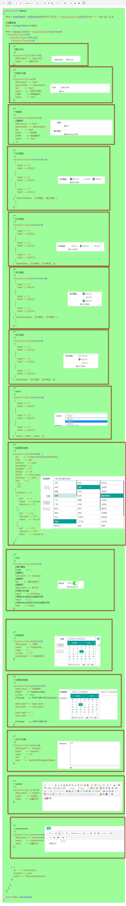

# 完成效果图
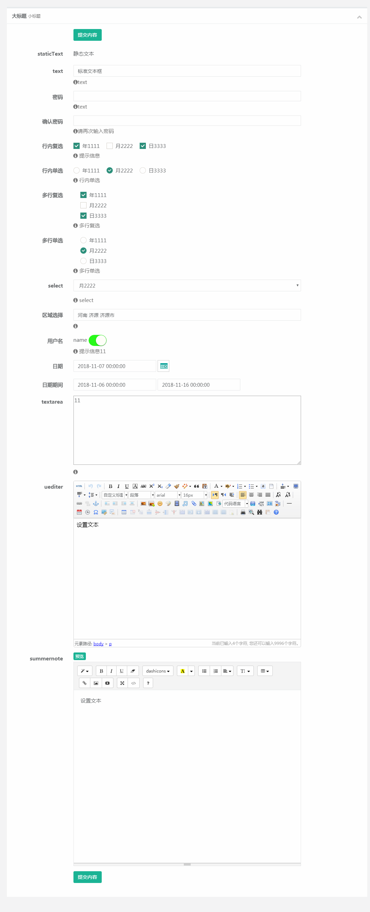

# 预览图

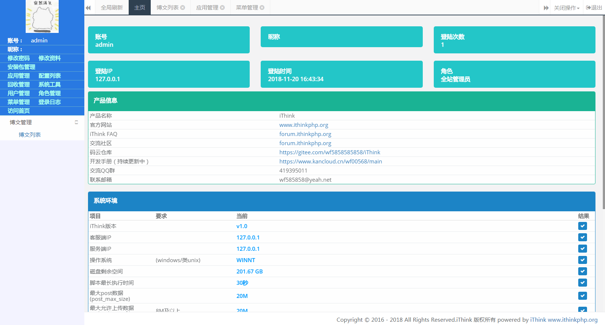
------ 

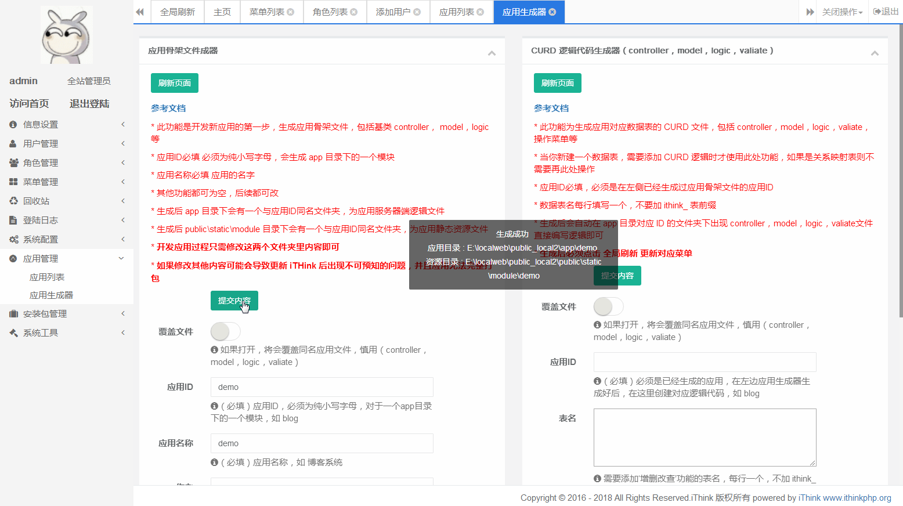
------ 

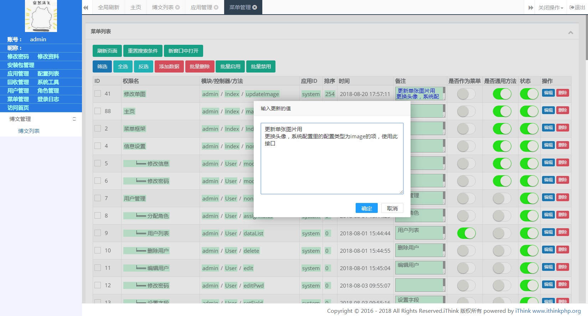
------ 

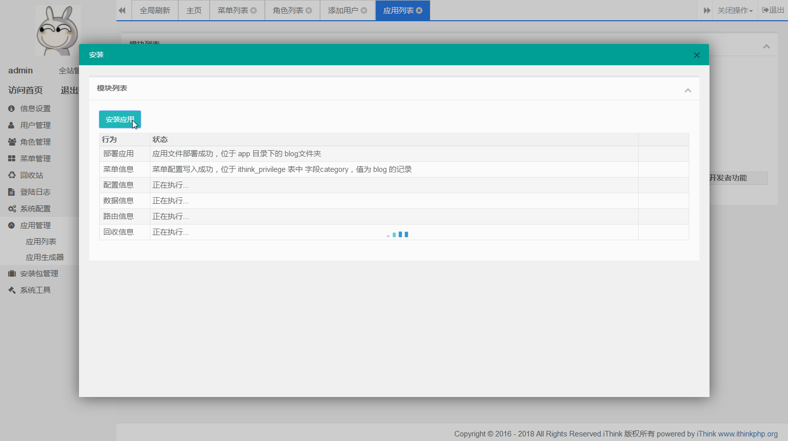
------ 

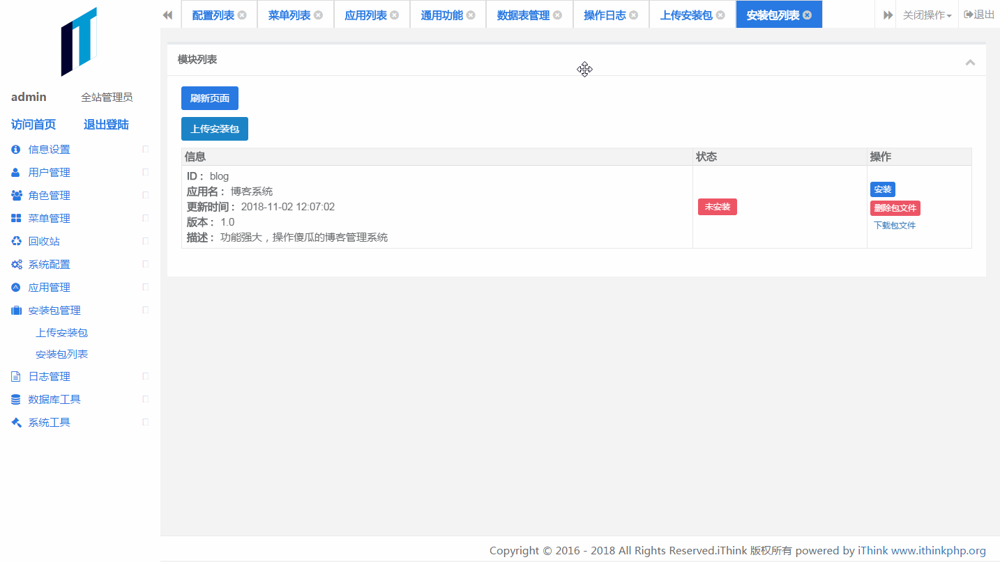
------ 

------ 

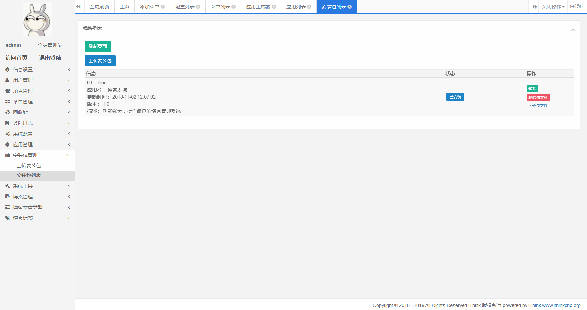
------ 

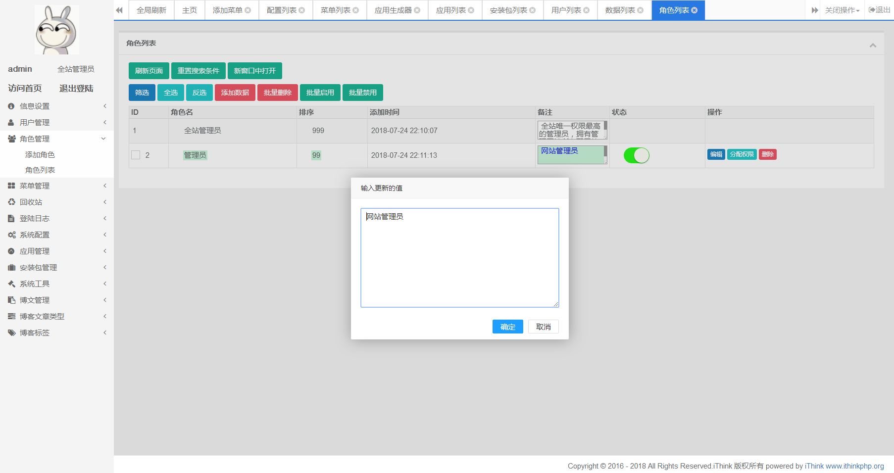
------ 

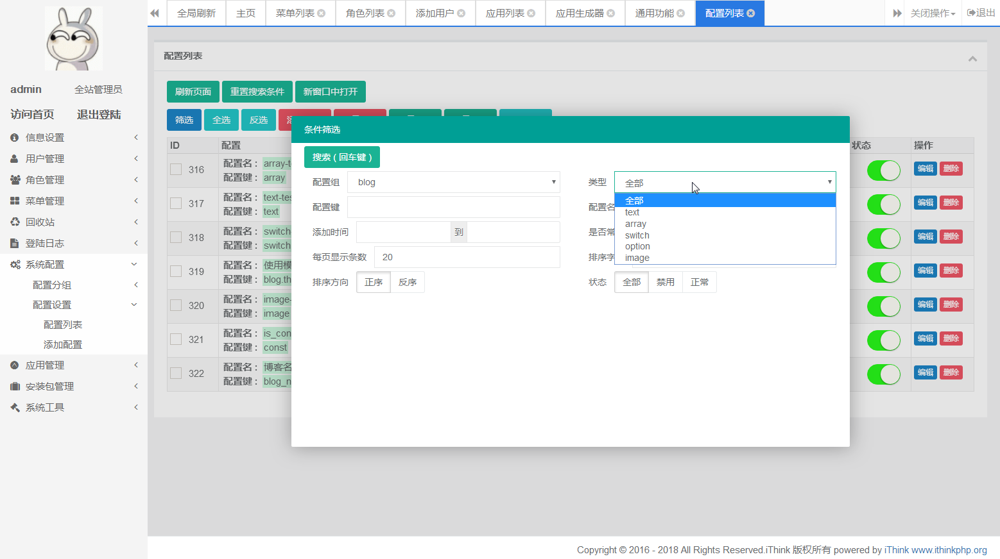
------ 

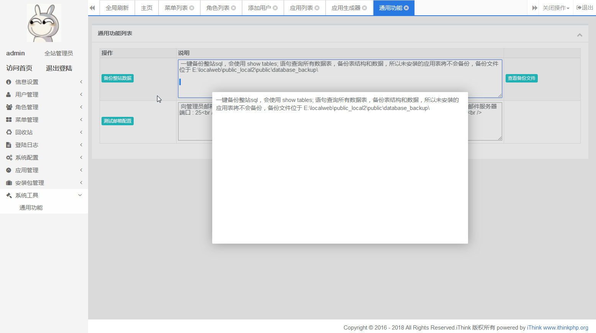
------ 

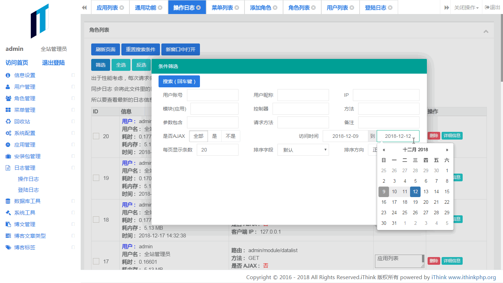
------ 

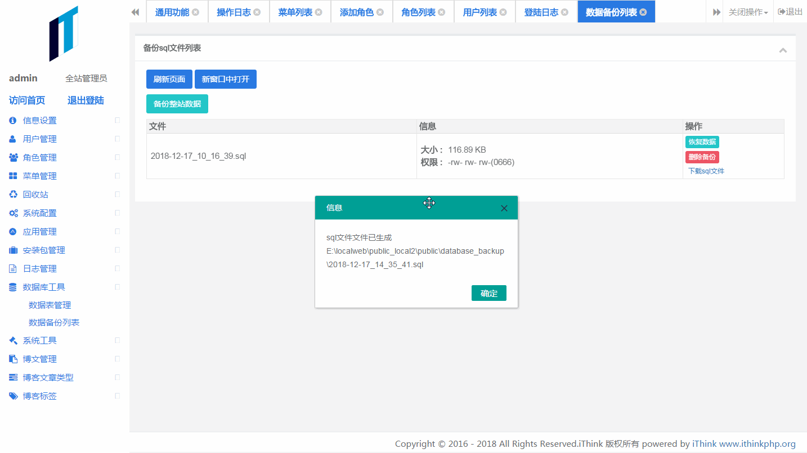
------ 

------ 

